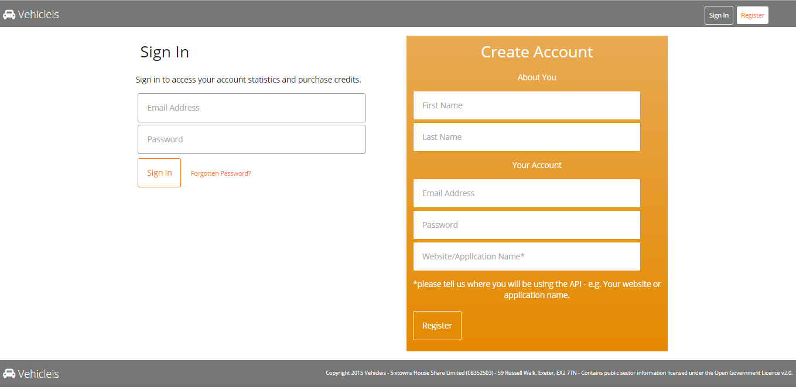

# VehicleLookup
Allows Mendix applications to look up a car details based on the registration. The Vehicle lookup module utilizes the services provided by [VehicleIs](http://vehicleis.uk/) to look up UK car details.

## Prerequisites 
The module requires that you have added to your project the RestModule and the Community Commons.

## To Setup your VehicleIs
Go to [Vehicle Is](http://vehicleis.uk/sign-in/) sign up page and enter your details on the create account section.

</img>

Then activate the account using the link you should receive in an email. This may go into your Junk Mail.
Sign into your account and you should see a an API Key. Copy this key and paste it into the constant API Key in the modeller.

## Using the lookup
To use the lookup I have created an example test page called `Test_Lookup` and a vechicle Information page called `Test_VehicleInformation`.
In the module there is a microflow called `SUB_VehicleLookup` which can be used as a subflow in another microflow to look up car details.

## Contribution
If you would like to extend or add some additional functionality please fork this repository and make a pull request.